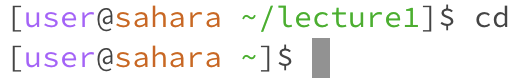
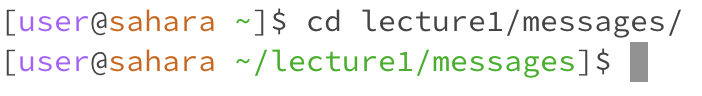
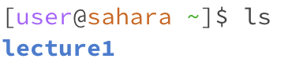
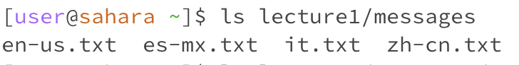
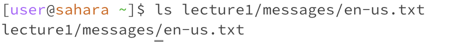
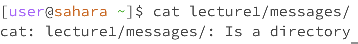
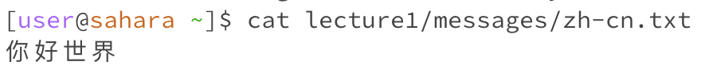

# Week 1: Remote Access and Filesystems
## Lab 1 Blog
1.  `cd` changes current working directory
- **with no arguments**
  initial working directory: `/home/lecture 1/` \
  \
  When `cd` has no arguments, it means that the user hasn't specified a directory. The command then just switches the working directory over to the one accessed last (the working directory before this current one), or to the base directory if there was no other directory accessed previously.

- **with path to directory as an argument**
  working directory: `/home`
  \
  The current directory is now set to the directory path specified by the coder/ user.
  
- **with path to file as an argument**
  working directory: `/home/lecture1/messages` \
  \
  The output is an error because `cd` is used to select a current directory, and a full path to file is not a directory; no files can be manipulated or created inside of a file the way you can inside a working directory, so a file path cannot be a working directory.

2. `ls` lists out contents of the directory (other files and folders in it)
- **with no arguments**
  working directory: `/home`\
  \
  When there are no arguments, the user hasn't specified a directory separate from the working directory to list the contents of, so the output is just the contents (folders and files) of the current working directory.

- **with path to directory as argument**
  working directory: `/home`\
  \
  The output is the contents (folders and files) of the directory specified by the user, since `ls` lists out the contents of the directory specified by the argument given by the user.

- **with path to file as an argument**
  working directory: `/home`\
  \
  The output printed in the terminal is just the file path specified in the argument. This is because `ls` will list all contents of the directory paths specified, and in the argument in this case, there is only a single item in the path: the file itself. 
  
3. `cat` concatenates file contents; prints them out in the command line
- **with no arguments**
  working directory: `/home`\
  \
  `cat` reads and displays file contents in the command line; when there is no argument, like in this case, that means that the user hasn't specified a file to read. Thus the default function of `cat` is to prompt the terminal to take in user inputted strings to perform concatenation on, resulting in the "blank line" output where the user can type a string that will then be read and printed on the next line.

- **with path to directory as argument**
  working directory: `/home`\
  \
  When a directory path is given, the output is a warning that the argument specified is a directory. Since `cat` works on files, it does not work on a directory since there are multiple files in there, and not sufficient information on what to concatenate.

- **with path to file as an argument**
  working directory: `/home`\
  \
  The output is the contents of the file, since `cat` reads file contents, concatenates them to string, and prints them out.
