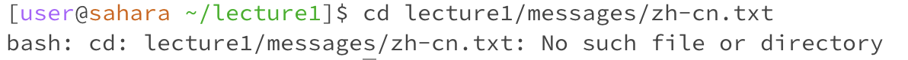

# Week 1: Remote Access and Filesystems
## `cd`
**with no arguments**
initial working directory: `/home/lecture 1/`

\
**with path to directory as an argument**

**with path to file as an argument**
working directory: `/home/lecture1/messages`

