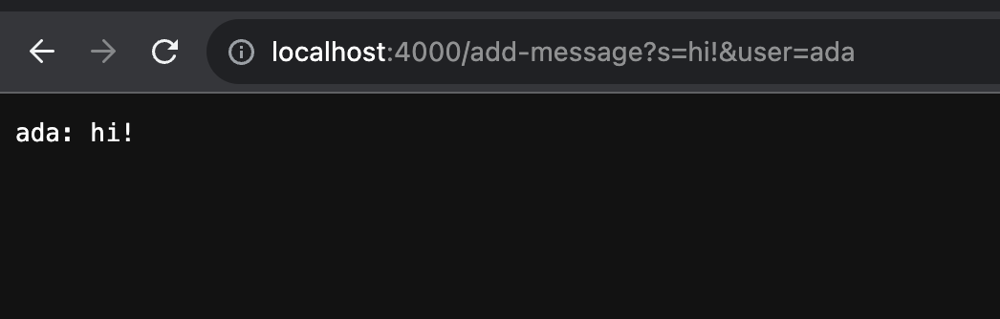
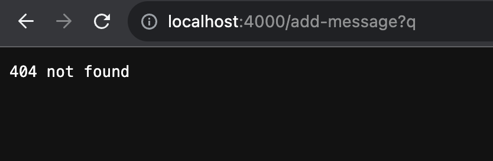
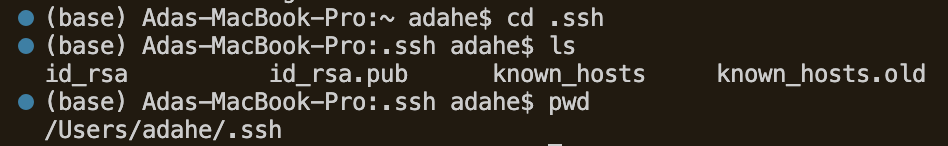
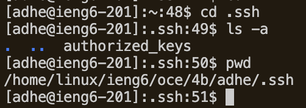
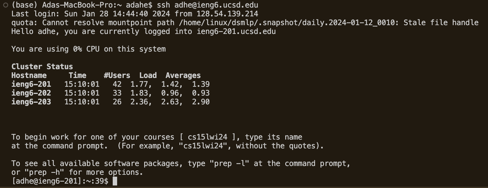

# Weeks 2 & 3: URLs & Servers, VS Code, and SSH Keys
## Lab 2 Blog

### Part 1: Building a Server

I drew from the NumberServer class we practiced with during lab section, the informational article linked in the NumberServer.java file, and JavaDoc to write the code for `ChatServer.java`.
```
import java.io.IOException;
import java.net.URI;

class Handler implements URLHandler{
    //state on the server
    String chat="";
    
    public String handleRequest(URI url) {
        if(url.getPath().equals("/")){
            return String.format("%s", chat);
        }else {
            if(url.getPath().contains("/add-message")){
                String[] info = url.getQuery().split("[&=]");
                String text = "";
                if(info[0].equals("s")){
                    text = info[1];
                    if(info[2].equals("user")){
                        chat += info[3] + ": " + text+"\n";
                        return String.format("%s",chat);
                    }
                }
            }
            return "404 not found";

        }
    }

}

public class ChatServer {
    public static void main(String[] args) throws IOException{
        if(args.length==0){
            System.out.println("Missing port number! Try any number between 1024 and 49151");
            return;
        }

        int port = Integer.parseInt(args[0]);

        Server.start(port, new Handler());
    }
}
```
**Server in action:**
1. 
- First, the main method in the `ChatServer` class is run to start the server at the port specified by the user in the terminal, or else throw an error with the message prompting the user to enter in a port number. The `Handler()` constructor is called when the port is specified and the server is successfully started, so the `Handler` class is called. This class has the relevant string field `chat`, which stores the string message(s) the user seeks to add with the url path `/add-message`. This class in turn calls the class's only method `handleRequest`. This method takes in an URI as an argument/parameter, which is the localhost url (with any user-specified path) the website is started on. In the case shown in the screenshot below, I specified a url path, so the argument going into `handleRequest(URI url)` is [http://localhost:4000/add-message?s=hi?&user=ada](http://localhost:4000/add-message?s=how%20are%20you?&user=friend). Because I specified a url path, `/add-message?s=hi&user=ada`, the body of the `else` statement in `handleRequest` is run, so the query is split into an array comprised of first 's', then the message that 's' is set equal to, then 'user', and finally the specified user bane that 'user' is set equal to in the path. The string field `chat` is then changed to `ada: hi` with a newline character, and returned so it displays on the server.
2. 
  - The main method in the `ChatServer` class is still run to start the server at the port specified or throw a error if a port isn't specified, and a `Handler` object is constructed like in the first case. The string field `chat` is still the relevant field of the `Handler` class. This time, the argument taken by the `handleRequest` method called when the constructor `Handler()` is invoked is the URI [http://localhost:4000/add-message?q](http://localhost:4000/add-message?q). Because 's' is not contained in this query (it does not follow the proper query format required for `/add-message` to perform its function), the modifications to the `chat` field's state are not execyted. For a closer explanation, this is because the value stored into the method's variable `String[] info` is just 'q'. Thus, the `if(info[1].equals('s')` statement evaluates to `false`, and `chat` is not updated or returned with a new value. Thus the code executes the return statement outside the `if/else` checks, showing the user a `404 not found` code.
 
### Part 2: SSH Keys
1. The absolute path to the private SSH key for my ieng6 account on my local machine is `/Users/adahe/.ssh/id_rsa`. The screenshot below shows that the contents of the `.ssh` directory include the private key; `id_rsa` is where the private key is and `id_rsa.pub` stores the public key(s).\

2. The public SSH key I generated during my lab and saved to my `ieng6` account can be found among the file system in this account. I logged in first to access this file system; the path to the location the public key is saved is `/home/linux/ieng6/oce/4b/adhe/.ssh/authorized_keys`.\

3. During lab, I saved a generated SSH key to my `ieng6` account so that I could log onto it without always needing to enter in my password. It worked, as shown below.\
 

### Part 3: Reflection
From lab in week 2, knew things I learned included what exactly the components of a link were (particularly that a query is a detail specified by the user, indicated by a question mark, and the path in a url is what leads to different pages/ triggers specific changes). I also learned the importance of a port number; a port is where a network/server is started, and the port number identifies this port. The lab taught me how to start a server from EdStem, a remote machine through my `ieng6` account, and also my computer's terminal (Lab 3 add on)! When I specified the port number as an argument, I could access my server from `https://localhost:<port number>` on my local machine! I learned how to use a new command line command, `curl`, to generate the link to the server I ran.
