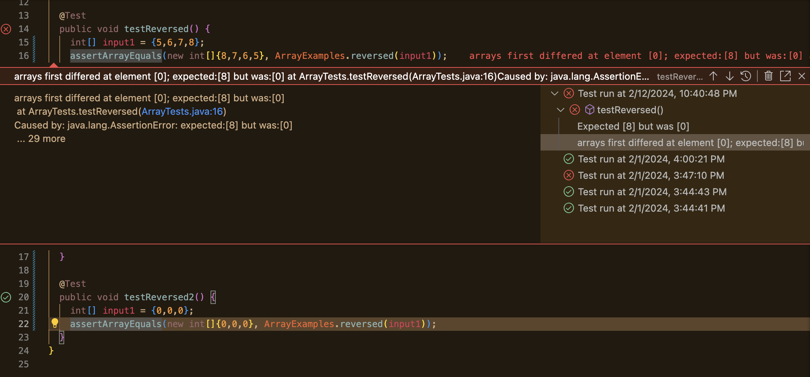
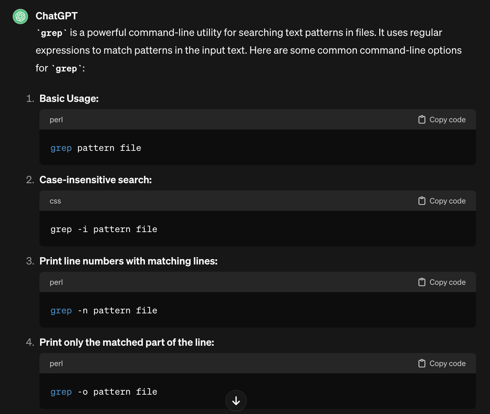
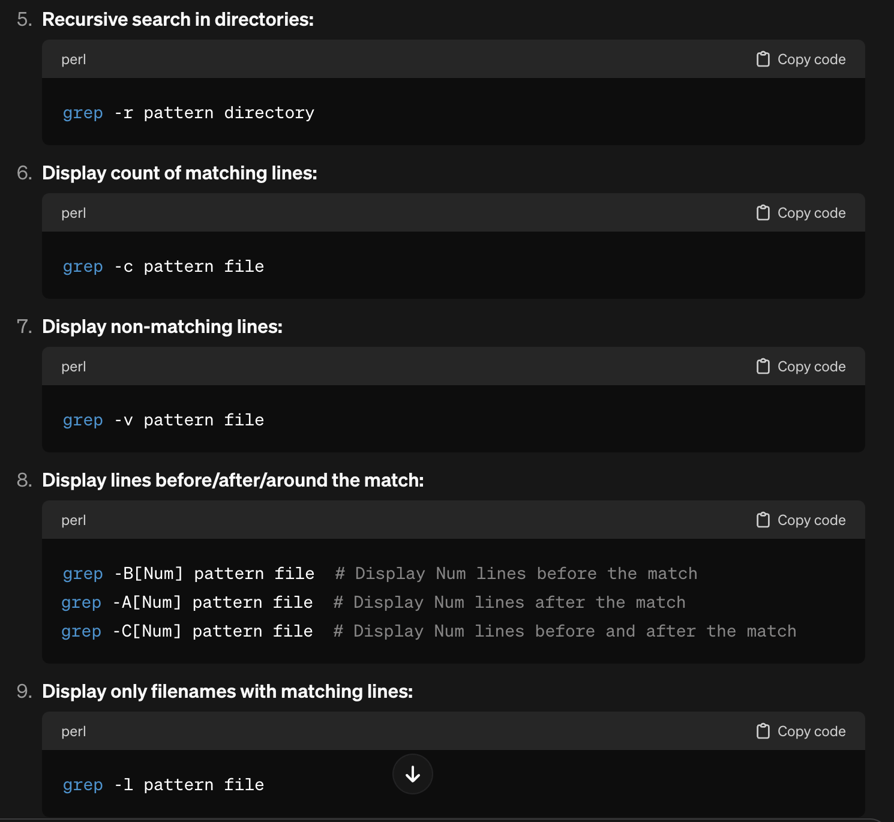
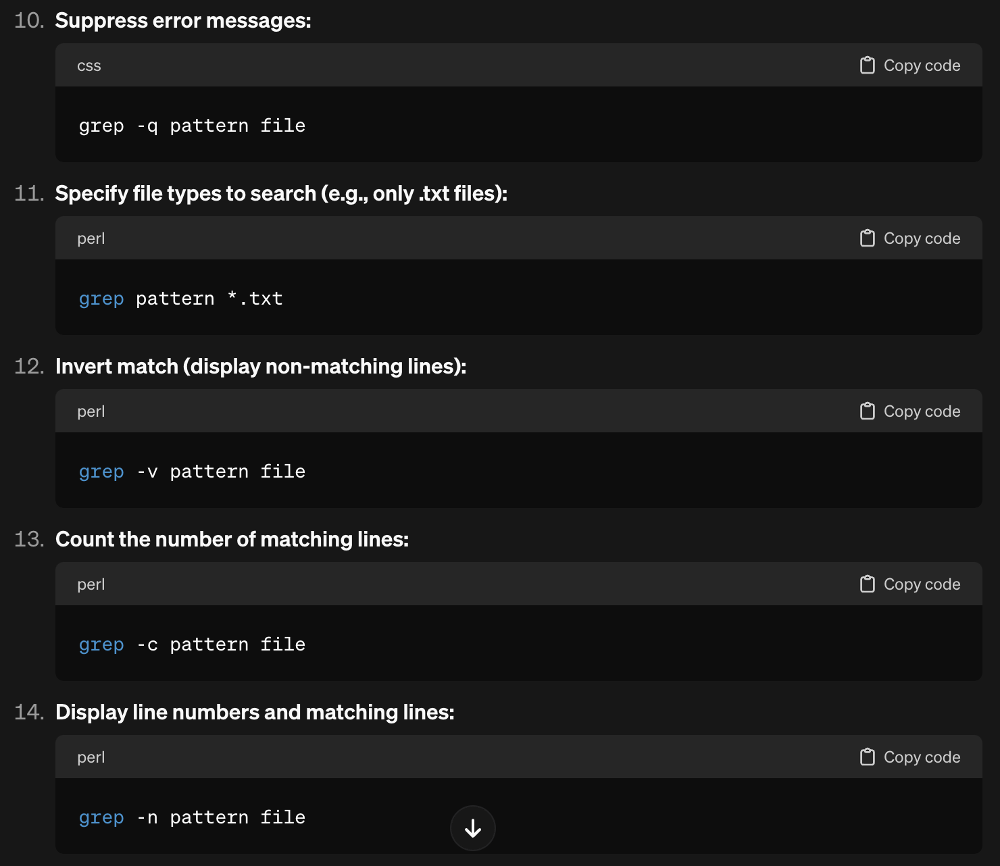
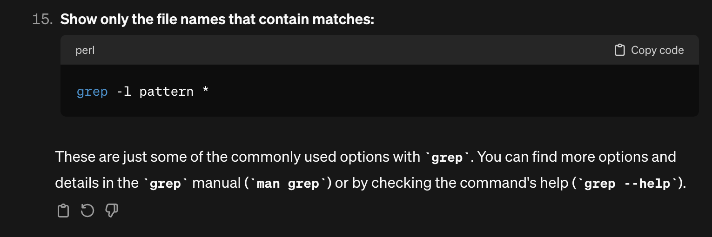

# Weeks 4 & 5: Bugs and File System Navigation
## Part 1: Bugs
The method `reversed` in lab 4 is buggy; it yields error in testing.
- failure producing input: when we input the array `{5,6,7,8}`, the code returns an error
  ```
  @Test
  public void testReversed() {
    int[] input1 = {5,6,7,8};
    assertArratEquals(new int[]{8,7,6,5}
  }
  ```
- non failing input: inputting an array of zero makes it so the JUnit test does not fail; the code passes.
  ```
  @Test
  public void testReversed2(){
    int[] input1={0,0,0};
    assertArrayEquals(new int[]{0,0,0}, ArrayExamples.reversed(input1));
  }
  ```
- **the symptom:** error that value found is 0 when expected last number of input array thrown by testing reversed with an array of nonzero values; no error thrown for array of zeroes.
  

- **the bug:** the bug lies in the array assignment and return. The reverse method is supposed to return an array with the values of the input array in reverse order, so the method creates a new array to do this, and the `for` loop is supposed to assign the values (from the last index to 0 index of the input array) to the new array from index 0 to the last index.\
  **Buggy code before the fix**
  ```
   static int[] reversed(int[] arr) {
    int[] newArray = new int[arr.length];
    for(int i = 0; i < arr.length; i += 1) {
      arr[i] = newArray[arr.length - i - 1];
    }
    return arr;
  }
  ```
  **Code with bug fixed**
  ```
   static int[] reversed(int[] arr) {
    int[] newArray = new int[arr.length];
    for(int i = 0; i < arr.length; i += 1) {
      arr[i] = newArray[arr.length - i - 1];
    }
    return arr;
  }
  ```
  The bug is line `arr[i] = newArray[arr.length-i-1]`  and `return arr`! This means that the original array arr is being assigned with the values of newArray in reverse order rather than the other way around. However, `newArray` is just initialized within the method as a new int array with no arguments, so all its values are automatically zero. Thus, arr just gets populated with zeroes and returned, giving the “got 0” instead of the reversed array error. This is also why an input of an array with only zero values does not fail; the `newArray` returned is an array of the same length as the input array, also with only zero values.

## Part 2: Command Research
I choose to analyze special uses of the `grep` command.\
The standard use of the command follows the formula `grep <command> <file to search>`. Some of the command line options include:
- `grep -i `:  case insensitive search
  The special label `grep -i` makes it so that the pattern's casing does not matter; variations of the pattern with uppercase and lowercase characters in any order are returned by the search as well. Like with the standard use of `grep`, the file paths (if multiple files are inputed) and a short excerpt where the pattern is located in the text is printed out in the terminal. This is helpful if you want to find all occurences of a word or phrase, whether or not it's at the start of a sentence or emphasized.\
  *example 1:*
  ```
  (base) Adas-MacBook-Pro:technical adahe$ grep -i "WHO" ./plos/*.txt
  ./plos/journal.pbio.0020001.txt:        several scientists, who present overwhelming evidence for the disparity in scientific
  ./plos/journal.pbio.0020001.txt:        lion's share (84.2%), followed by Canada (10.35%). Latin America as a whole contributed
  ./plos/journal.pbio.0020001.txt:        itself as compared with the GDP of Latin America as a whole. In fact, Albornoz (2001)
  ./plos/journal.pbio.0020001.txt:        Although there are outstanding scientific researchers in the developing world who
  ./plos/journal.pbio.0020010.txt:        Kevin Guthrie, who found the quickest way through the maze of conflicting advice—much of
  ...
  ```
  *example 2:*
  ```
  grep -i "capps" ./911report/*-12.txt
                called CAPPS. More than half were identified for further inspection, which applied
                the place of CAPPS. The deployment of this system has been delayed because of claims
                    lists should not be delayed while the argument about a successor to CAPPS
            CAPPS is still part of the screening process, still profiling passengers, with the
  ```
- `grep -r`: recursive search through directories
  The `grep -r` command runs recursively, so it repeats for different levels of files as it enters subdirectories within the working directory, finishes a search of them, and moves on into another subdirectory for all subdirectories and nested layers of files within the working directory to look for the pattern. This is really helpful if you want to find all occurrences of a pattern within an file system, not just a single file or folder.\
  *example 1:*
  ```
  (base) Adas-MacBook-Pro:technical adahe$ grep -r "doctorate"
  ./government/Media/Texas_Supreme_Court.txt:doctorate in jurisprudence from Southern Methodist University
  ./government/Media/GreensburgDailyNews.txt:and a jurisprudence doctorate from Indiana University-Indianapolis
  ./plos/journal.pbio.0030032.txt:        great majority of bachelor's and master's degree holders, and 40% of doctorates. In other
  ./plos/journal.pbio.0030032.txt:        For science-based businesses, then, the American S&E doctorate—viewed by many as the
  ./plos/journal.pbio.0020054.txt:        grasses rubbing together or even by magic. A fire scientist whose doctorate is in tropical
  ./plos/journal.pbio.0020214.txt:        immediately after getting the candidate degree (the equivalent of a Western doctorate).
  ./plos/journal.pbio.0020172.txt:        United States, Bela Julesz, with his Hungarian doctorate in engineering, joined the
  ```
  *example 2:*\
  You can specify which directory to recursively search through after the pattern.
  used `grep -r "deoxyribonucleic" ./biomed`
  ```
  (base) Adas-MacBook-Pro:technical adahe$ grep -r "deoxyribonucleic" ./biomed./biomed/ar130.txt:          complementary deoxyribonucleic acids (cDNAs) [ 11].
  ./biomed/1471-2350-3-12.txt:        cDNA complementary deoxyribonucleic acid
  ./biomed/1471-2350-3-12.txt:        DNA deoxyribonucleic acid
  ./biomed/gb-2003-4-9-r60.txt:        biochips including complementary deoxyribonucleic acid
  ./biomed/1471-2164-3-7.txt:        - deoxyribonucleic acid, PBS - phosphate buffer saline, DEX
  ```
- `grep -o`: displays only matching part of lines
  The `-o` label counters the `grep` command's standard behavior of printing out the excerpt (including some characters/ text preceding and following the appearance of the pattern), instead only displaying the the pattern itself for each time it's identified in the file; if the `grep -i` command was given multiple input files, then the file path is printed before the matching string segment. This is helpful for preventing the terminal from being inundated with text; it reduces scrolling and makes counting the appearances per file of a certain pattern cleaner.\
  *example 1:*
  ```
  (base) Adas-MacBook-Pro:technical adahe$ grep -o "CAPPS" ./911report/*-12.txt
  CAPPS
  CAPPS
  CAPPS
  CAPPS
  ```
  *example 2:*
  ```
  (base) Adas-MacBook-Pro:technical adahe$ grep -o "New York City" ./911report/*.txt
  ./911report/chapter-1.txt:New York City
  ./911report/chapter-1.txt:New York City
  ./911report/chapter-1.txt:New York City
  ./911report/chapter-1.txt:New York City
  ./911report/chapter-1.txt:New York City
  ./911report/chapter-1.txt:New York City
  ./911report/chapter-10.txt:New York City
  ./911report/chapter-12.txt:New York City
  ./911report/chapter-12.txt:New York City
  ./911report/chapter-13.2.txt:New York City
  ./911report/chapter-13.2.txt:New York City
  ./911report/chapter-13.2.txt:New York City
  ./911report/chapter-13.3.txt:New York City
  ./911report/chapter-13.3.txt:New York City
  ./911report/chapter-13.4.txt:New York City
  ./911report/chapter-13.4.txt:New York City
  ./911report/chapter-13.5.txt:New York City
  ./911report/chapter-13.5.txt:New York City
  ./911report/chapter-13.5.txt:New York City
  ./911report/chapter-13.5.txt:New York City
  ./911report/chapter-13.5.txt:New York City
  ./911report/chapter-13.5.txt:New York City
  ./911report/chapter-13.5.txt:New York City
  ./911report/chapter-13.5.txt:New York City
  ./911report/chapter-3.txt:New York City
  ./911report/chapter-3.txt:New York City
  ./911report/chapter-5.txt:New York City
  ./911report/chapter-5.txt:New York City
  ./911report/chapter-7.txt:New York City
  ./911report/chapter-7.txt:New York City
  ./911report/chapter-8.txt:New York City
  ./911report/chapter-8.txt:New York City
  ./911report/chapter-9.txt:New York City
  ./911report/chapter-9.txt:New York City
  ./911report/chapter-9.txt:New York City
  ./911report/chapter-9.txt:New York City
  ./911report/chapter-9.txt:New York City
  ./911report/chapter-9.txt:New York City
  ./911report/chapter-9.txt:New York City
  ./911report/chapter-9.txt:New York City
  ./911report/chapter-9.txt:New York City
  ./911report/chapter-9.txt:New York City
  ```
- `grep -l`: display only file names of files with matching lines\
  This command searches through the specified file/ files for the pattern, and if the pattern is found, it only prints out the file names (and their relative paths) of the files that contain the pattern in the terminal. It's very helpful for when you want to count the exact number of files (of a certain type) that contain the pattern, or if you want to know which files contain info on a certain topic (i.e. for research, so you can go through and read them to get info on your desired pattern).\
  *example 1:*
  ```
  (base) Adas-MacBook-Pro:technical adahe$ grep -l "virus" ./biomed/ar*.txt
  ./biomed/ar104.txt
  ./biomed/ar331.txt
  ./biomed/ar409.txt
  ./biomed/ar429.txt
  ./biomed/ar601.txt
  ./biomed/ar619.txt
  ./biomed/ar745.txt
  ./biomed/ar774.txt
  ./biomed/ar795.txt
  ```
  *example 2:*\
  If the command is called on a specific file, and the pattern is found in that file, it still returns the relative path (output is a single relative path to the specified file).
  ```
  (base) Adas-MacBook-Pro:technical adahe$ grep -l "a" ./biomed/ar104.txt
  ./biomed/ar104.txt
  ```
  ## Citations
  I used ChatGPT to help with my research on the `grep` command! I inputed the prompt
  "what are command line options for grep?" and received a list of labels with a short phrase describing its use. From there, I did my own command line testing of each label, and without referring back to the ChatGPT outputs, summarized in my own words what the command was doing. I noticed that ChatGPT's responses contained repetition - the algorithm shared a few labels more than once.\
  **ChatGPT's output:**
  
  
  
  
