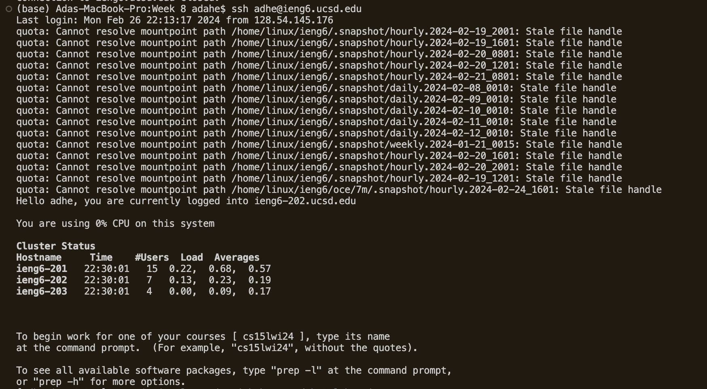
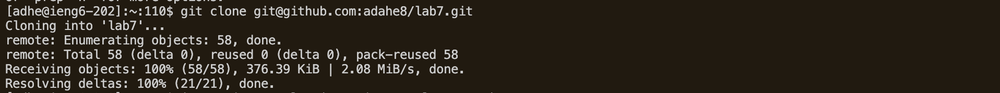
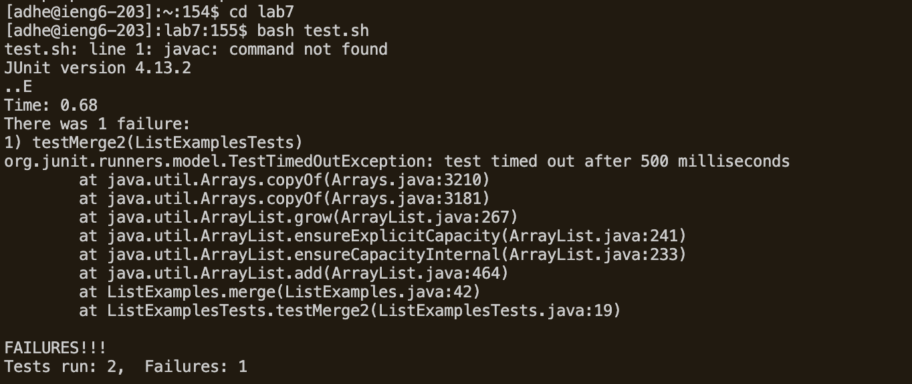
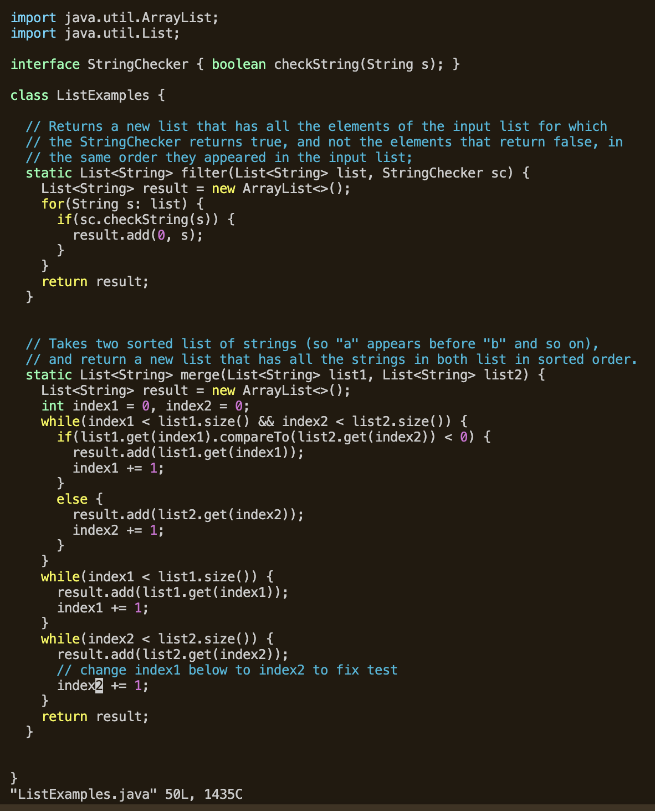
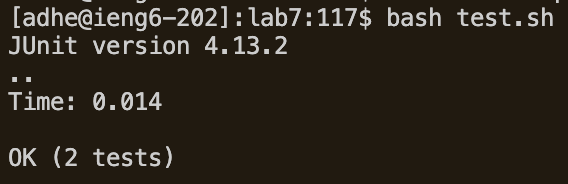
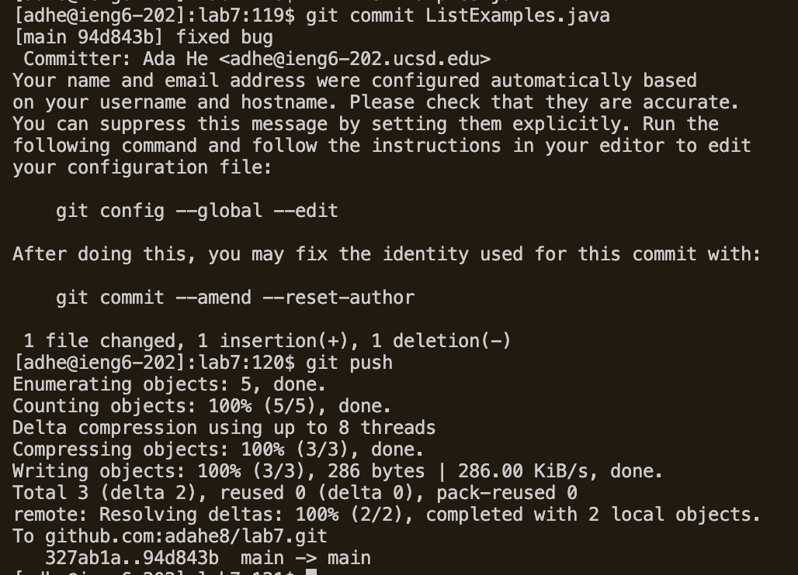
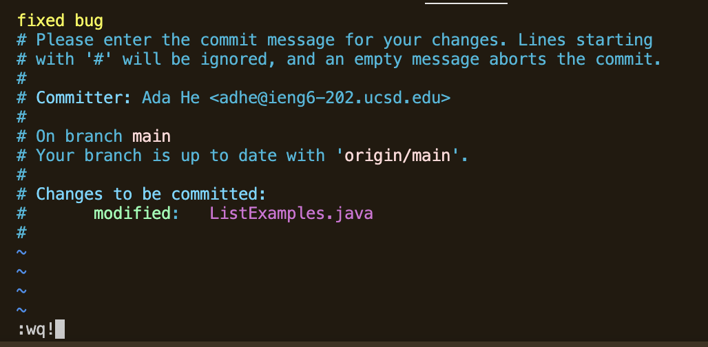

# Weeks 6 & 7: JUnit & Vim
4. **Login to `ieng6`**  
  
Keys pressed: `<up><up><up><up><enter>` - `ssh adhe@ieng6.ucsd.edu` was 4 commands up in my bash history, so I had to press the up arrow key 4 times to get it.
5. **Clone the repository for lab 7**  
  
Keys pressed: `<Ctrl><R> g <enter>` - in my command history, the most recent instance where I began a command with `g` was when I typed `git clone git@github.com:adahe8/lab7.git` to clone the lab7 repository during lab, so it appeared the moment I pressed the `g` key in the terminal's search mode. To run this command again, I pressed enter.
6. **Run the tests in `ListExamplesTests.java`**  
  
Commands & keys pressed: `cd lab7`,`<Ctrl><R>ba<Enter>`. I had to first `cd` into lab7 to have it as my working directory, so I could run the `test.sh` file. During week 7's lab, I had used the `bash test.sh` command while working through the lab, but because `<Ctrl><R>` search yields the commands that contain `b` anywhere in the text, it was not the first command to appear. Typing 'a' next did make `bash test.sh` populate the line (it's the most recent command containing `ba` in sequence that I had run), so I pressed `<Enter>` to run it again. The `test.sh` file contained the code to run the tests, so I got the displayed test results.
7. **Fix the bug**  
  

Commands used & keys pressed: `<Ctrl><R>vim L<Enter>` got the `vim ListExamples.java` command to populate the current terminal line, since I had used it during lab on Thursday, but used `vimtutor` again since, so it was not the first value to appear when I typed `v` in search mode. My use of `<Enter>` ran the command again, so the code in `ListExamples.java` appeared in Vim on my screen, with my cursor at the first character at the top. From there, I pressed the following string of keys: `44$bbhh` to navigate my cursor over the the  '1' at the end of `index1` (since the bug is that `index1` is incremented instead of `index2`) - I knew from the `test.sh` output that the bug was on line 44, and `$` in vim lets me jump to the end of each line. From there, I used `bb` to backtrack 2 'word' spaces (segments of space separated code), and 'hh' to backtrack 2 more spaces to the left so my cursor was in the right place. Then I pressed `r2`: in vim `r` replaces the character under the cursor with the specified character. Finally, to save my changes and close out, I used `:wq!`
9. **Run tests again to confirm fix**  
  
Keys pressed: `<up><up><Enter>` - `bash test.sh` was 2 up in my command history, so I used the up key twice to navigate to it, and then I hit the enter key to run it again. The output in terminal shows that all tests have indeed passed, indicating that my fix was successful.
10. **Commit & push changes to Github**  
Commands in terminal:
  
The vim editor that opens after running the `git commit` command:
 
Commands: I first used `git commit <command><C><command><V><Enter>`, where I copy-pasted the name of the changed file, `ListExamples.java`, from its appearance in a prior command in the terminal (`vim ListExamples.java`), and ran it. This opened up the commit message screen in vim, shown above, where I pressed `i` to enter insert mode and typed in my commit message, before pressing `<Ctrl><C>` to exit insert mode. Then I used `:wq!` to save and close out/ submit my commit message. Finally, I typed the command `git push` to add and store my changes to `lab7` on the remote repository on Github.
