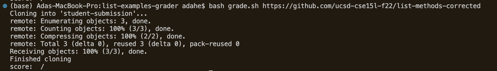
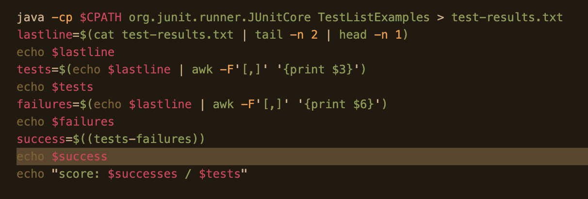
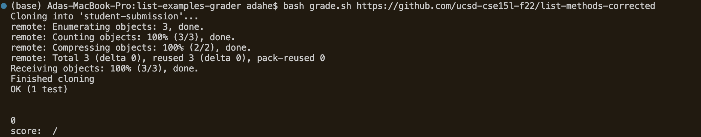
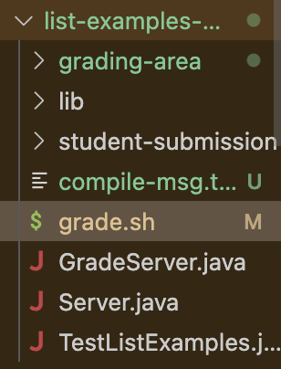

# Week 9: Debugging & Synthesis
## Part 1: Debugging Scenario

Here is a sample Edstem post for a debugging scenario!
### Student
**Ansa Mei**  
Hello! I'm experimenting the autograder example introduced to us during lecture in Lab 6, and I'm encountering an issue when I run my grader.sh file. I;t catches missing files and compile errors within the github repos that the program takes as input just fine, but it won't print out the score like it should - instead of printing out the number of succesful tests / total number of tests, it just prints a slash with no numbers. Here's a picture of the symptom with the terminal command that triggered it:  
  
I think the bug might be in my definitions for the ` tests `, ` failures `, variables, since for some reason the numbers of tests and `successes` aren't getting fetched from the `jUnit` test output.  Here's my code:  
  

Why might I be getting this error? Can I get help debugging?

### Tutor
Hi Ansa!  
Thanks for providing the symptom, program code, and command line input! You're on the right track about the location of the bug - think about how the command `awk` works - you can look up other resources, read online documentation and ask ChatGPT for clarification on the definitions. What inputs pair with the command? How do you specify delimeters? I'd also recommend using print statements to check the values of your variables, to see if you are extracting the correct values from the `jUnit` tester output. Take a look at the `jUnit` output you're interested in and compare it to your variable values. Good luck debugging, reach out if you have any more questions!

### Student Follow Up (Bug Description)
Hi Tutor!
Thanks for your feedback - I realized that I didn't include a space character in my delimeters for awk when I should have, since I want to split the final test-count output string of the jUnit tests into a list of words, and that means breaking them up by spaces as well as commas. Now I'm getting this output though - there's another bug I'm not catching in the same code.  
  

**File system**  
  

## Part 2: Reflection
During the second half of this quarter, I learned a lot about debugging! Particularly, I found our practice with `jdb` really helpfull and interesting; figuring out the location of infinite loops required a lot more manual scanning at first, so I really appreciated how `jdb` allowed me to check local variable values and identify the  location of the issue. I also loved how we covered in class the methods that ChatGPT could be used constructively to help improve programming efficiency!
